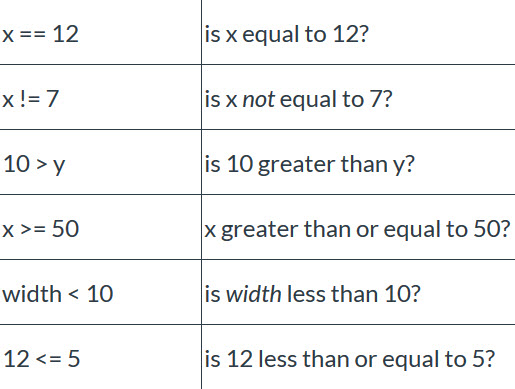

## sketch.js

In order to program a sequence of interactive choices and events, we will use **if** statements.

These **if** statements contain conditions that the computer verifies as either true or false. Depending on the answers to a conditional if statement, the computer will execute specific code commands, or ignore them.

## sketch2.js

If the computer program verifies that a certain numerical statement is true then it will execute the code. In order to write these expressions, we need to use relational operators.



**CAREFUL!**  
**A double equal sign "==" is a question of equality.**

*Is x equivalent to 500?*  
  `if (x==500){ //doSomething }`

*Assign value of 500 to x*  
x = 500


## sketch3.js

You can combine two boolean values using the **AND** operator, which looks like two ampersands: `&&` (Cmd + 8) or (Ctrl + 8)

The **AND** operator evaluates to true whenever *both* boolean values on either side of it are also true.


## sketch4.js

The **OR** operator evaluates to true if *either* of the two boolean values on either side of it is true.

To use the **OR** operator, type two pipes `||` (option  + 7) or (alt + 7) between two boolean values.


## sketch5.js, sketch6.js

We can extend the **if** structure to allow for a choice between two or more conditions. To do this, we will use **else if**.

The keyword **if** is always required, always used once, and only used once per conditional statement.

```
if(condition){
    doSomething()
}
```

The keyword **else if** is optional and used as many times as needed after **if**.

```
else if (condition){
    doSomething()
}
```


The keyword **else** is optional, only used once, and always last in the sequence. It can follow **if** or **else if**.

```
else{
    doSomething()
}
```
